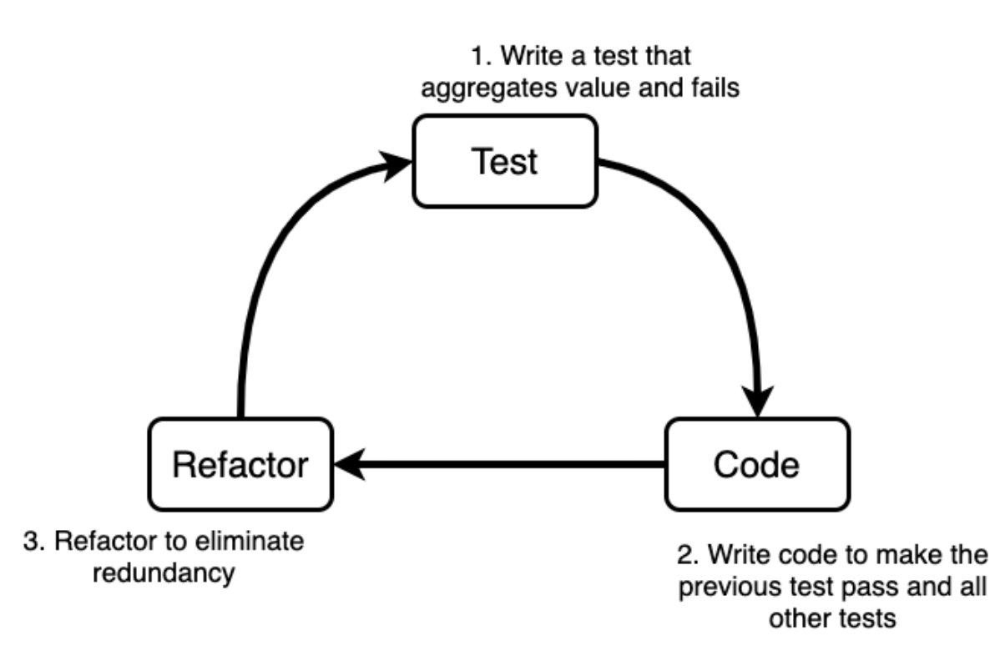

# Chapter 1: Deepdive into TDD

To understand TDD, which means test driven development, we need to understand the concepts of **test to code**. Which basically means that we need to have a perspective of what we want before starting developing the game. This has to be done in a way that we know beforehand which tests we are going to write and how we can iterate over them to develop our game. Also, it is important that our tests have a positive impact in our code, as redundant testing doesn't really improve the code quality, therefore, simply writing a test that passes right away doesn't improve our code, even though it can be useful sometimes outside the TDD flow. This means that a meaningful test has to break the current game flow, by failing, and the code that we write from that point on should be the minimum for our test to start passing. More than that, just passing is not enough, it should pass the test that we have written and not break the other tests that we wrote. There is a famous image on TDD that is sometimes called the mantra of TDD "red (test), green (code), refactor' which I would like to explain:

Image: TDD Cyle

Unfortunately this image may not be very intuitive, so let's explain it a bit.
1. We need to understand our test cases and what we want from them. 
2. We do that by writing the smallest test that fails and aggregates value to our game, considering how we planned for the game to be developed.
3. Having a failing test is something that we can't accept, so we write the minimal amount of code that makes our failing test pass without failing all of our other tests.
4. Now we can go further and refactor our code. Refactoring means that we will look for code smells, redundancies and things we can eliminate, so that we can improve the code quality. To do that we need to make sure all our tests keep passing. 
5. Now we can loop back to step 2 until there are no more test cases.
6. At last, all our test cases are done. We can check if it integrates and it is functional within our code.
7. Go to step 1 again for other test cases.
