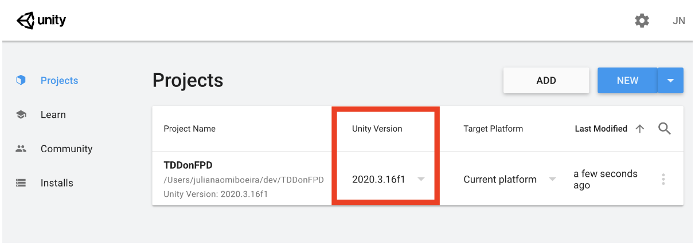
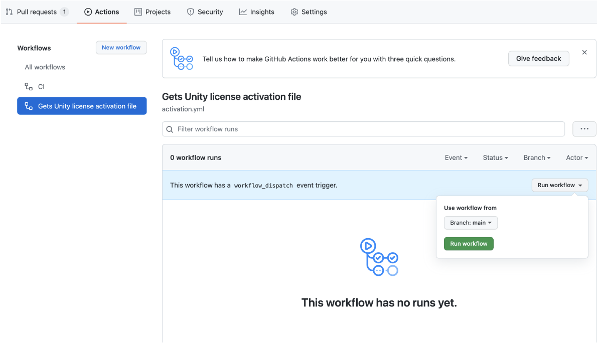
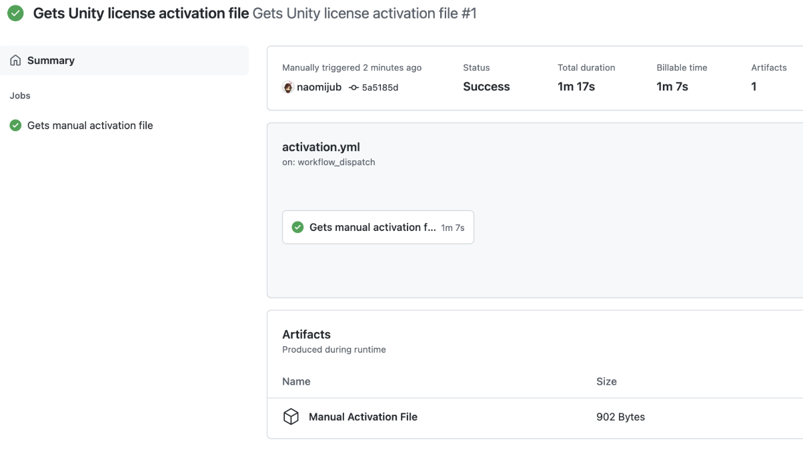
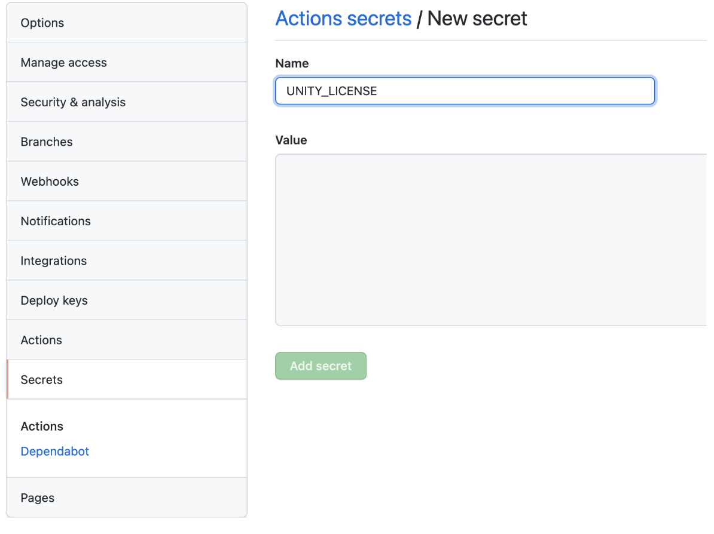

# Chapter 7: CI for Games

There are a large number of CI tools that are compatible with games. However, there might be some resistance to adopt them, so here are a few benefits not only related to the development cycle that can help to sell the CI usage:
* Non-developers can check the current state of the game at any time, considering that the CI triggers a continuous delivery process for alfa or beta versions.
* A press/media version can always be available, for example in a complete example scene.
* The publisher can always identify and keep up with the game's current version. 
* It is guaranteed that the game works on different platforms that have been tested.
* It is easy to get the latest build version.
* Easier to identify bugs, which is really important to the business side as it can reduce the time to fix them as well as avoid releasing games with bugs.

## CI for Unity

As I am of the opinion that every modern software project should have a CI/CD pipeline associated with it, Unity is no exception. There are a few options to configure a CI for Unity, but the most obvious one is [Unity Cloud Build](https://docs.unity3d.com/Manual/UnityCloudBuild.html) as it is Unity's native CI tool, it is very well documented and a complete up to date guide can be found in Learn Unity's [website](https://learn.unity.com/tutorial/unity-cloud-build#5c80546dedbc2a183757dd84). However, it may not be the perfect tool for your project and it works better as a continuous builder only tool than a CI/CD tool. The other obvious choice is to use some kind of CI like Github Actions, GitlabCI, Travis-CI, Game.CI or CircleCI. Unfortunately, I have had a lot of problems configuring Unity's CI with Travis-CI and I do not recommend it, as even though it did work at some point, it has to be continuously fixed for future changes. So, as most of my projects are on Github I usually choose Github Actions as my CI. 

The best way to create an Unity Github Actions is with the newly created Game.CI, which is a rebrand of Unity Actions, combined with Unity Builder for the build step. 

## Dockerizing Unity

Game-ci/docker are specialised Unity Docker images for CI and command-line tools, which are named unity-ci/editor and can be found at https://hub.docker.com/r/unityci/editor, choose your unity version. The only problem with this, so far, is the limited IL2CPP support (Ubuntu Only) and versions newer than 2019. You can find your Unity version in Unity Hub as the following image shows:



To execute this docker image you can run `docker run -it unityci/editor:ubuntu-2020.3.16f1-mac-mono-0 command`, which means we want to run a docker container (unityci/editor), in interactive mode (`-it`) with the tag `ubuntu-2020.3.16f1-mac-mono-0`. The Unity editor will be located at `/opt/unity/Editor` as `Unity`. Now we need to create the activation file, to do that change your directory o the Editors directory by executing `cd /opt/unity/Editor` and run the command `./Unity -quit -batchmode -nographics -lgFile -createManualActivationFile`, you will see a message saying **Manual activation license file saved**. The `-quit` flag tell Unity it need to quit after executing our commands, the `-batchmode` means it is only going to run on command-line, `-nographics` means no graphic device is going to be initialized, `-logFile` outputs the log to the console and `-createManualActivationFile` will generate a file that allows us to create a license for the docker. You can see the file executing ls and it will be named `Unity_v2020.3.16f1.alf`. To get the alf file content we can just execute `cat Unity_v2020.3.16f1.alf` and copy its content (from <?xml…> to </root>):
```xml
<?xml version="1.0" encoding="UTF-8"?><root><SystemInfo><IsoCode>C.UTF</IsoCode><UserName>(unset)</UserName><OperatingSystem>Linux 5.10 Ubuntu 18.04 64bit</OperatingSystem>__<UnityVersion Value="2020.3.16f1" /></License></root>
```
Save this file in your machine as the alf file and go to [Unity's activation page](https://docs.unity3d.com/Manual/ManualActivationGuide.html) to get our license file https://license.unity3d.com/manual. Download the `Unity*.ulf` license file, send the file to your docker container by executing `docker cp ./Unity_v2020.x.ulf 1c25b08a74dd:/opt/unity/Editor`, which means copy a file from file location in host to container_id 1c25… at path `/opt/unity/Editor`, container id can be found with `docker ps`, and activate it by executing `./Unity -batchmode -manualLicenseFile Unity_v2020.x.ulf -logfile`. Now you can run any game commands with /Unity as long as your container has an associated Dockerfile to build the container with the necessary project files. The game commands that we will run inside the container are equal to the one we will execute, nextly, in github actions.

## Configuring Github

There are not a lot of secrets to work with Git and Unity, one important thing is to make sure that you have an up to date `.gitignore` file and forcing your `.meta` files to be text mode. To generate and up to date `.gitignore`, I recommend checking https://www.toptal.com/developers/gitignore/api/unity, just take care when ignoring `[Oo]bj` and `[Bb]uild` because some objects and folders use those names and can be ignored. Basic steps are as follows:
1. Create a repo on github.
2. `git init` you local Unity folder or git clone from remote and start your unity project there. If `git init` set your remote to the empty repository `git remote add origin git@git.path.git`.
3. Add a `.gitignore` and a License file if required.
4. `git add .` and commit with `git commit -m "<your message>"`. Then push.
5. To create a new work branch you can execute `git checkout -b <branch name>`.
Another important issue in game development is file locking, Which means that only one person can edit a file at a time. This is because git cannot resolve merge conflicts for blob files with its standard tools. Sound effects, 3D objects, sprite sheets, fonts, tiles and binaries in general need locking, also, prefabs and even meta files can cause huge merging conflicts if not locked. The first recommendation would be to have your locked files concentrated in one or a few folders that don't have code or not frequently edited code.

Two important concepts that we can explore for this kind of behavior are partial clones and sparse checkouts. Partial clones allow us to avoid downloading large binary folders so that we can clone them whenever we need them in a just in time manner, discarding the binary objects history. This will help us work only with the latest binaries. A partial clone that removes binaries (blobs) is defined as a clone with a filter tag defining blobs to `none`, `git clone --filter=blobs:none`, which will download the blobs metadata but not the file content itself. The sparse flag, `--sparse` can be used to clone only the files in the root directory and can be used to avoid downloading the blob folders in less complex projects. The whole command can look like `git clone --filter=blob:none --sparse git@git.path.git`. To retrieve the missing folders without caring about their history you can use the sparse checkout command with the path to the folder/file, `git sparse-checkout add /path/to/folder/or/file`.

With these techniques we can discuss file locking. File locking works as follows, it is assumed that nobody can write to that file unless explicitly asked and if the file is unlocked. We can do this by using `git-lfs` file locking feature, which doesn't mean we need to store the files in git-lfs, but we just use its locking feature. To use `git-lfs` be sure you have lfs installed in your machine and CI and then install it in your project with `git lfs install`.

To use `git-lfs` locking feature we need to use a file called `.gitattributes`, which is a collection of file patterns and attributes, something like `**/*.png lockable`, that sets the attribute lockable to a PNG files in path `**/*`. To lock a file for local development you can type `git lfs lock /path/to/file`, you should receive a message saying `Locked /path/to/file`. This will lock the file in all branches. To unlock it add the changes, commit them and push, then run `git lfs unlock /path/to/file`, a message saying `Unlocked /path/to/lock`.

### Configuring Github Actions

We have already generated a license, but now we need to generate a github/workflow that activates this license. First step is to go to your repository in github and click `Actions`, as Unity doesn't have a preset workflow you will need to click on `set up a workflow yourself`, which will automatically be called `main.yml`:

```yaml
name: CI
 
on:
 push:
   branches: [ main ]
 pull_request:
   branches: [ main ]
 workflow_dispatch:
 
jobs:
 build:
   runs-on: ubuntu-latest
   steps:
     - uses: actions/checkout@v2
     - name: Run a one-line script
       run: echo Hello, world!
     - name: Run a multi-line script
       run: |
         echo Add other actions to build,
         echo test, and deploy your project.
```

Now we can create another yml file named `activation.yml`, at `.github/workflows`, that will be responsible for getting Unity's license file:

```yaml
name: Gets Unity license activation file
 
on: workflow_dispatch
 
jobs:
 getManualActivationFile:
   name: Gets manual activation file
   runs-on: ubuntu-latest
   steps:
     - uses: actions/checkout@v2
     - uses: game-ci/unity-request-activation-file@v2
       id: getManualLicenseFile
     - uses: actions/upload-artifact@v2
       with:
         name: Manual Activation File
         path: ${{ steps.getManualLicenseFile.outputs.filePath }}
```

The name tag is just the name of the action to be executed and `on: workflow_dispatch` means that this will only be executed when we order it to dispatch. There will be one job named `getManualActivationFile` running on an Ubuntu machine. This workflow needs to be manually triggered and it will generate a `Manual Activation File`, to do this go to `Actions > Get Unity license activation file > run workflow`. Once it is done, the file will be available to download at the workflow execution under the name `Manual Activation File`. Download the file and unzip it to retrieve the .alf file and follow the same process as we did with docker to retrieve the `.ulf` file. Now go to your repository Settings then Secrets, copy the ulf file content and paste it into a new repository secret called `UNITY_LICENSE`.







For professional and pro licenses you will be required to have 3 more repository secrets:
* UNITY_SERIAL: the professional License serial key.
* UNITY_EMAIL: your Unity login email.
* UNITY_PASSWORD: your Unity login password.

## Build your project on the CI

Now that we have our project CI configured we can start building it. It makes no sense to build our project in the CI without having a base project, so I recommend you to have an empty project with this step. Let's start simple and then expand our build.

The minimal build for the CI is under Jobs add this `simple_build`:

```yaml
jobs:
 simple_build:
   runs-on: ubuntu-latest
 
   steps:
     - uses: actions/checkout@v2
     - uses: game-ci/unity-builder@v2
       env:
         UNITY_LICENSE: ${{ secrets.UNITY_LICENSE }}
       with:
         targetPlatform: WebGL
```

This build will basically use your `UNITY_LICENSE` secret, which is accessed using `${{ variable }}` syntax,  to build your project targeting the WebGL platform. It maybe be useful to store the built artifact, for that you can add a new step after the `unity-builder@v2` with the following configuration:

```yaml
- uses: actions/upload-artifact@v2
  with:
    name: <Your build name>
    path: build
```

But this build takes a while to execute and there is a simple way to solve this, which is caching the `Library` folder. If you check the build description, you will see it took a while to execute all the commands associated with the Library folder, so to cache it we can add:

```yaml
- uses: actions/checkout@v2
- uses: actions/cache@v2
  with:
    path: Library
    key: Library-${{ matrix.targetPlatform }}
    restore-keys: Library-
- uses: game-ci/unity-builder@v2
```

Note that the cache step is before the `unity-builder@v2` step and I have added a `matrix.targetPlatform` variable, which we will shortly use. If you have only one target platform, please use only its name.

To include multiple platforms, we will be required to define a `strategy` before defining the `steps`. We can do that by defining the strategy tag that contains a matrix tag with all platforms. Also, we can generate a different build for every platform by naming our build `name: Build - ${{ matrix.targetPlatform }}`.

```yaml
build:
  name: Build - ${{ matrix.targetPlatform }}
  runs-on: ubuntu-latest
  strategy:
    fail-fast: false
    matrix:
      targetPlatform:
        - StandaloneOSX
        - StandaloneWindows
        - StandaloneWindows64
        - StandaloneLinux64
        - iOS
        - Android
        - WebGL
  steps: ...
```

There are many other build configurations that can be found in the [GameCI/github/builder page](https://game.ci/docs/github/builder), but for now we are going to start testing our game.

## Testing your project on the CI

Just like unity-builder on CI, unity-test-runner expects some tests to exist, and to do that you should create some Unity tests, which are explained in the next chapter. Test runner is not that easy to start small and expand, because there are many nice configurations we can do to make sure we have a minimal adequate test setup. So, our test job looks like the following:

```yaml
jobs:
 testAllModes:
   name: Test in ${{ matrix.testMode }}
   runs-on: ubuntu-latest
   strategy:
     fail-fast: false
     matrix:
       testMode:
         - playmode
         - editmode
   steps:
     - uses: actions/checkout@v2
       with:
         lfs: true
     - uses: actions/cache@v2
       with:
         path: Library
         key: Library-${{ matrix.testMode }}
         restore-keys: |
           Library-
     - uses: game-ci/unity-test-runner@v2
       id: tests
       env:
         UNITY_LICENSE: ${{ secrets.UNITY_LICENSE }}
       with:
         testMode: ${{ matrix.testMode }}
         artifactsPath: ${{ matrix.testMode }}-artifacts
         githubToken: ${{ secrets.GITHUB_TOKEN }}
         checkName: ${{ matrix.testMode }} Test Results
     - uses: actions/upload-artifact@v2
       if: always()
       with:
         name: Test results for ${{ matrix.testMode }}
         path: ${{ steps.tests.outputs.artifactsPath }}
 build: ...
```

Our job will be defined as testAllModes with a name tag that varies depending on the `matrix.testMode`. `Unity-test-runner` has three possible modes: **playmode**, which will only execute playmode test, **editmode**, which will only execute editmode tests, and all, which will execute playmode and editmode tests. As a quick reference, editmode tests are unit level tests that don't execute Start, Awake and Update functions from Unity's MonoBehaviour, while playmode tests execute those functions allowing you some control over how many update frames you want. The testModes are defined in `strategy > matrix > testMode`.  We have already talked about caching, but we don't actually need the testMode variable for this test. Then we execute the `unity-test-runner@v2` with `UNITY_LICENSE`, the with tag defines parameters to be used, in which testMode is one of the possible test modes, `artifactsPath` is where we want to upload our test artifacts, `checkName` is the name in which we want this artifacts to be and `githubToken`, which is automatically generated, allows us to the github status check results for our test. Lastly, we upload the artifacts with `actions/upload-artifact@v2` step, defining that it will always be uploaded, `if: always()`, under the name `Test results for $testMode` in the path defined in `artifactsPath`.

### Improving execution time

One thing that is annoying with this CI configuration is that some git large files take too long to execute. Fortunately there is a solution for this, which is to cache the Git Large File by adding this script after the checkout action, `actions/checkout@v2`:

```yaml
- name: Create LFS file list
  run: git lfs ls-files -l | cut -d' ' -f1 | sort > .lfs-assets-id
- name: Restore LFS cache
  uses: actions/cache@v2
  id: lfs-cache
  with:
    path: .git/lfs
    key: ${{ runner.os }}-lfs-${{ hashFiles('.lfs-assets-id') }}
- name: Git LFS Pull
  run: |
    git lfs pull
    git add .
    git reset --hard
```

And the complete script is:

```yaml
name: CI
 
on:
 push:
   branches: [ main ]
 pull_request:
   branches: [ main ]
 
 workflow_dispatch:
 
jobs:
 testAllModes:
   name: Test in ${{ matrix.testMode }}
   runs-on: ubuntu-latest
   strategy:
     fail-fast: false
     matrix:
       testMode:
         - playmode
         - editmode
   steps:
     - name: Checkout code
       uses: actions/checkout@v2
       with:
         lfs: true
     - name: Create LFS file list
       run: git lfs ls-files -l | cut -d' ' -f1 | sort > .lfs-assets-id
     - name: Restore LFS cache
       uses: actions/cache@v2
       id: lfs-cache
       with:
         path: .git/lfs
         key: ${{ runner.os }}-lfs-${{ hashFiles('.lfs-assets-id') }}
     - name: Git LFS Pull
       run: |
         git lfs pull
         git add .
         git reset --hard
     - name: Cache Library
       uses: actions/cache@v2
       with:
         path: Library
         key: Library-Test
         restore-keys: |
           Library-
     - name: Run test ${{ matrix.testMode }}
       uses: game-ci/unity-test-runner@v2
       id: tests
       env:
         UNITY_LICENSE: ${{ secrets.UNITY_LICENSE }}
       with:
         testMode: ${{ matrix.testMode }}
         artifactsPath: ${{ matrix.testMode }}-artifacts
         githubToken: ${{ secrets.GITHUB_TOKEN }}
         checkName: ${{ matrix.testMode }} Test Results
     - name: Upload artifact for test in ${{ matrix.testMode }}
       uses: actions/upload-artifact@v2
       if: always()
       with:
         name: Test results for ${{ matrix.testMode }}
         path: ${{ steps.tests.outputs.artifactsPath }}
 build:
   name: Build - ${{ matrix.targetPlatform }}
   runs-on: ubuntu-latest
   strategy:
     fail-fast: false
     matrix:
       targetPlatform:
         - StandaloneOSX
         - WebGL
 
   steps:
     - name: Checkout code
       uses: actions/checkout@v2
     - name: Create LFS file list
       run: git lfs ls-files -l | cut -d' ' -f1 | sort > .lfs-assets-id
     - name: Restore LFS cache
       uses: actions/cache@v2
       id: lfs-cache
       with:
         path: .git/lfs
         key: ${{ runner.os }}-lfs-${{ hashFiles('.lfs-assets-id') }}
     - name: Git LFS Pull
       run: |
         git lfs pull
         git add .
         git reset --hard
     - name: Cache Library
       uses: actions/cache@v2
       with:
         path: Library
         key: Library-${{ matrix.targetPlatform }}
         restore-keys: Library-
     - name: Build for ${{ matrix.targetPlatform }}
       uses: game-ci/unity-builder@v2
       env:
         UNITY_LICENSE: ${{ secrets.UNITY_LICENSE }}
       with:
         targetPlatform: ${{ matrix.targetPlatform }}
```

Note that I have added names for each step.

## Deploying artifacts

Deploying artifacts with a CI is not a big mystery, and it is less of a mystery when we can combine Unity, Wasm, WebGL, Github Actions and Github Pages. In this example we will deploy an artifact to github pages, but the mechanics of doing so is similar in any platform:
- 1. Generate a build to the target platform in your CI.
- 2. Store that build somewhere.
- 3. Have the platform deployment credentials stored in your CI.
- 4. Run a script that can deploy the build with the correct credentials in the target platform.

For  the github actions to deploy to github pages we need to build Unity targeting WebGL, which we already do in our `build > strategy > matrix > targetPlatform > WebGL` script. However, we still need to store the built artifact somewhere, which we can do by adding the following to the build script:

```yaml
      - name: Build for ${{ matrix.targetPlatform }}
        …
      - uses: actions/upload-artifact@v2
        with:
          name: build-${{ matrix.targetPlatform }}
          path: build/${{ matrix.targetPlatform }}
```

Basically this means that after we build the artifact for `matrix.targetPlatform` we will use the action `actions/upload-artifact@v2` to upload the artifact with name `build-${{ matrix.targetPlatform }}` in the path `build/${{ matrix.targetPlatform }}`. Now we need to configure github pages.

### Configuring Github Pages

The first thing I do to use github pages is to create a github pages branch, which I usually call `gh-pages`. Having that branch created we can enable github pages in our repository by going to `Settings > Pages`. For our purposes now, the only important fields are **sources** and the checkbox **Enforce HTTPS**. 

Enforce HTTPS is as it says, it enforces that your page is using HTTPS, while sources is where the configuration actually happens. You can see that your sources have a `branch` dropdown, choose the branch that you built items will be available, in our case `gh-pages`, than choose the folder that your build will be, usually there are only two options `/root` and `/docs`, I usually deploy to root. Hit the `save` button. Custom domain is in case you have a hosted domain that you want the code to be deployed to and theme is the theme style that you want your github pages to have.
For Github Pages WebGL projects on Unity make sure to set publishing `compression format` to `disabled`. To do this go to `File > Build Settings > Player Settings > (Select WebGL icon) > Publishing Settings > Compression Format`.

### The deploy script

The deploy script cannot be executed before (or in parallel with) the build script, as it requires an uploaded build to generate its deployment. To make sure or this order we tag the deploy script with `needs: build`, then we give it a name and set it to run in linux:

```yaml
  deployPages:
    needs: build
    name: Deploy to Github Pages 🚀
    runs-on: ubuntu-latest
    steps: …
```

Now the necessary steps are to download the artifact from the storage and run an action to deploy it in github pages, we can do that with the following actions:

```yaml
deployPages:
    …
    steps:
      - name: Checkout code
        uses: actions/checkout@v2

      - uses: actions/download-artifact@v2
        with:
          name: build-WebGL
          path: build

      - name: Deploy 🚀
        uses: JamesIves/github-pages-deploy-action@4.1.4
        with:
          branch: gh-pages
          folder: build/WebGL
```

Now, check the github pages and play. The link to your github pages can be found in your repository at `Settings > Pages`.

One important notice is that to deploy to Android and iOS some packaging conventions may be required, for Android the package must be named `com.YourCompanyName.YourProductName`. More information on deploying to platforms may be found at game ci.
