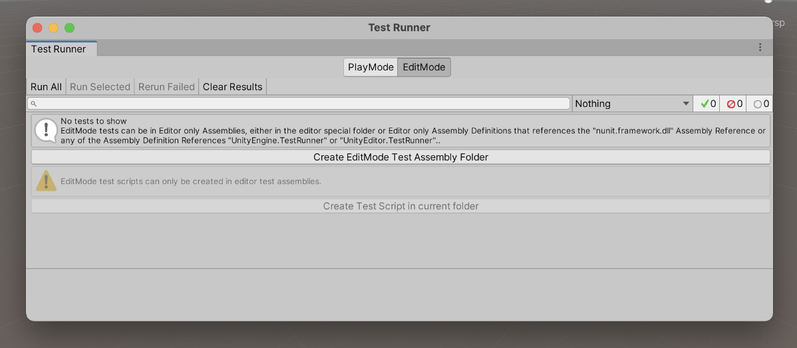
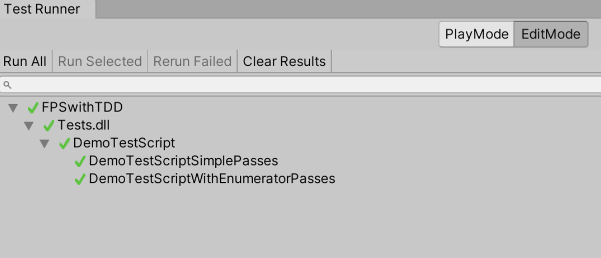
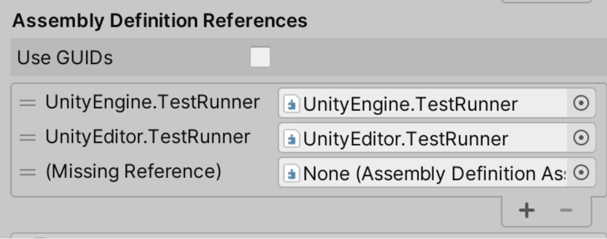

# Chapter 8: Introduction to game testing with game engines and setting up a test environment.

For game development frameworks like Monogame, GGEZ, Raylib, Pygame, LibGDX, Phaser that behave like packages (libraries, crates, or, however, you call it), it is  fairly easy to develop games and have a good test coverage on them. Sadly, most games developed with these frameworks are poorly tested or have no test at all. Besides famous game development frameworks there are a few game engines that allow us some level of testing, especially when we use the language native testing resources, like Panda3D, Godot, Amethyst, AppGameKit and jMonkey. However, when we speak about the big engines in the market like Unity, Unreal and CryEngine the reality is not that simple. Fortunately, Unity has been putting great effort into making games testable.

I first heard of automated testing in Unity a few years back when they released the package called [Unity Test Tools](https://github.com/spe3d/unitytesttools). This package was deprecated and later included in the current `Unity Test Runner`, which is now incorporated into the engine. Test runners are basically a test executor and in the case of Unity a test executor that can run specific Unity tests. Also, around the same time I saw a few talks from Tomek Paszek and in one of them he expressed that one of the motivations behind the Unity Test Tools package was the fact that some parts of unity were being developed with unit testing, but there was no testing resource for the games themselves.

Currently it is fairly easy to find resources about testing and game development, and there is even an article written by Sophia Clarke called [Testing Test Driven Development with Unity](https://blog.unity.com/technology/testing-test-driven-development-with-the-unity-test-runner) where she explores the viability of developing a game with TDD in Unity. Also, I highly recommend reading the [NUnit C# test package documentation](https://docs.nunit.org/), as it is the default test package for Unity.

Now we can start the test environment setup and run some simple tests. 

## Configuring the Unity test environment

The first thing we need to do is download the latest Unity version, this book was written using **Unity 2020.3.16f1 LTS**, so the test setup is supposed to be usable in a few later versions, as well as versions 2018 and 2019. With the Unity Hub downloaded, login and activate your license. Then choose version 2020.3.16f1 LTS and download it.

Unity has two type annotations, `[Test]` and `[UnityTest]`. The difference between them is that `UnityTest` can execute in `playmode` and make assertions over actions and events in playmode, while `Test` executes only over functions that are independent from the playmode, namely editmode. The following step by step may seem trivial, but as it can be little altered from version to version, it is important to have it written down so at least for the 2020 LTS version, anyone can do it.

1. Download UnityHub from https://store.unity.com/pt/download.
2. Login and activate your license in preferences.
3. Download Unity version 2020.3.16f1 LTS.
4. Click in **NEW** to create a new project.
5. Choose the 3D template and a project name. My project name was *FPSwithTDD*.
6. To find the test runner go to `WINDOW > GENERAL > TEST RUNNER`.


Image: Unity test runner

7. At first, the Test Runner should be empty as no test has been configured. To create a `Test Assembly Folder` you should click in `Create EditMode Test Assembly Folder` and then a folder `Tests` will be created.
8. If we open the `Test Assembly File` inside the `Tests` folder we will see a bunch of pre-selected configurations. Be sure to check the desired test platforms in the `platforms` field.
9. Now we need to create a demo test, to do that click on `Create Test Script in current folder`. I named my new test script `DemoTestScript`. If we open the test script we will see that the two testing frameworks are being used using `NUnit.Framework` for using `[Test]` and `Assert` as well as using `UnityEngine.TestTools` for using `[UnityTest]`. `UnityTest` should have a return type of `IEnumarator` and you can use `yield return null` to skip 1 frame.

```c#
using System.Collections;
using System.Collections.Generic;
using NUnit.Framework;
using UnityEngine;
using UnityEngine.TestTools;
 
public class DemoTestScript
{
   // A Test behaves as an ordinary method
   [Test]
   public void DemoTestScriptSimplePasses()
   {
       // Use the Assert class to test conditions
   }
 
   // A UnityTest behaves like a coroutine in Play Mode. In Edit Mode you can use
   // `yield return null;` to skip a frame.
   [UnityTest]
   public IEnumerator DemoTestScriptWithEnumeratorPasses()
   {
       // Use the Assert class to test conditions.
       // Use yield to skip a frame.
       yield return null;
   }
}
```

10. To run the tests go to the Test Runner and click `Run All`.


Image: Executing all tests

11. There is another annotation that may be interesting to know. `[UnityPlatform]` helps us determine the target (or excluded) platform to execute the tests. To define a target platform, let's say Windows, define it as `[UnityPlatform(RuntimePlatform.WindowsEditor)]`. To exclude Windows platform we can just use `[UnityPlatform(exclude = new[] {RuntimePlatform.WindowsEditor })]`.
12. Finally, it is important to know that if you want to test logs you can use the Unity assertion for logs as follows: `LogAssert.Expect(LogType.Log, "Log message")`.

## Writing our first test

The first test we will write is a check to know if our player is alive. To do that  we need to create a new test script, which I will call `PlayerAliveTestScript`, go to the Tests folder and click in `Create > Testing > C# Test Script` and rename it. I have created only one `[Test]` defined by `public void IsAlive_WhenInstantiated_ReturnsTrue()`.

Now we need to create a Scripts folder and in it I have created a script called `PlayerLife`. This script will have a function called `IsAlive` that will return a `bool`. And now our test `IsAlive_WhenInstantiated_ReturnsTrue` will be testing if the function call `IsAlive` on the variable `player` of type `PlayerLife` is true. The test will look like this:

```C#
[Test]
public void IsAlive_WhenInstantiated_ReturnsTrue()
{
   var player = new PlayerLife();
   Assert.AreEqual(true, player.IsAlive());
}
```

So, we need to make this test compile creating the function `IsAvile` in `PlayerLife` script. Be aware that if your script inherits from `MonoBehaviour` you should not use the `new PlayerLife()` declaration, it works with the warning `"You are trying to create a MonoBehaviour using the 'new' keyword.  This is not allowed.`  MonoBehaviours can only be added using `AddComponent()`. Alternatively, your script can inherit from ScriptableObject or no base class at all".

```C#
using System.Collections;
using System.Collections.Generic;
using UnityEngine;
 
public class PlayerLife : MonoBehaviour
{
   public bool IsAlive() {
       return false;
   }
}
```

However, if we try to execute the test runner we will get a message saying `"Assets/Tests/PlayerAliveTestScript.cs(12,26): error CS0246: The type or namespace name 'PlayerLife' could not be found (are you missing a using directive or an assembly reference?)"`. This compilation error is telling us that to associate the scripts with the tests we need an `assembly reference`. To solve this problem, we need to right click in `Scripts` folder and select `Create > Assembly Definition`. I named my scripts assembly definition as `ScriptsDefinition`. With this done, we can go to the Tests folder assembly definition and create a new `Assembly Definition Reference` by clicking the `+` button. And then drag and drop the assembly definition from the scripts folder into the `Missing Reference` new field.


Image: Creating a new Assembly Definition Reference

To make this test pass we can, for now, make it return true and have the test pass. The last step is to fix the warning `"You are trying to create a MonoBehaviour using the 'new' keyword..."`. To do that we will need to define a `SetUp` annotation that creates a `GameObject` and adds the component `PlayerLife` to it. Now, instead of declaring a `new PlayerLife()` every time we need to access the MonoBehaviour, we can use `GetComponent<PlayerLife>()`. As follows:

```C#
using System.Collections;
using System.Collections.Generic;
using NUnit.Framework;
using UnityEngine;
using UnityEngine.TestTools;
 
public class PlayerAliveTestScript
{
   GameObject go;
 
   [SetUp]
   public void SetUp() {
       go = new GameObject("test");
       go.AddComponent<PlayerLife>();
    }
 
   [Test]
   public void IsAlive_WhenInstantiated_ReturnsTrue()
   {
       PlayerLife player = go.GetComponent<PlayerLife>();
 
       Assert.AreEqual(true,player.IsAlive());
   }
}
```

### Summary

To remember important actions on configuring test environments in Unity I will sum them up here:
1. You can find the test runner at `WINDOW > GENERAL > TEST RUNNER`.
2. In the test runner click in` Create EditMode Test Assembly Folder` and then a folder Tests will be created.
3. In the Assembly Definition of the tests folder, check all required platforms.
4. To create a new test script just click the button with the message `Create Test Script in current folder`.
5. To execute the available test scripts just click `Run All` in the top left corner of the test runner.
6. To create new tests you can just go to `Create > Testing > C# Test Script`.
7. To use scripts outside the `Tests` folder you should define a Scripts folder and add an Assembly Definition to it, `Create > Assembly Definition`. The Tests folder should have an Assembly Definition Reference to the Scripts folder Assembly Definition.
8. Now you can use other scripts and tests them.
