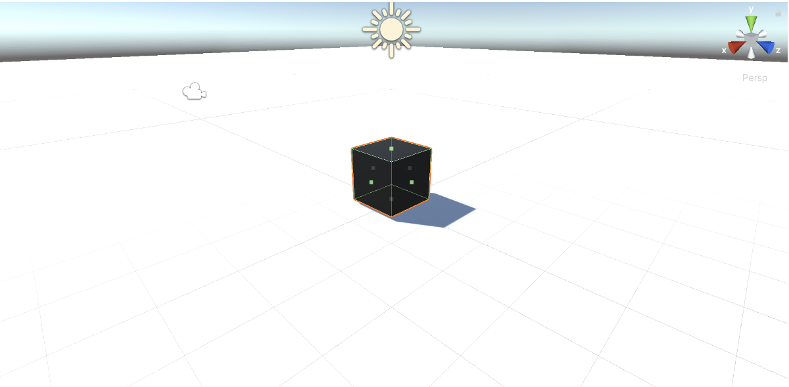

# Chapter 11: Testing Keyboard Input

Now that we have the test environment configured we can start our test fow for an FPS game and to do that let's start by the basics, testing keyboard input. In this chapter we will explore how to deal with keyboard interactions, commonly named inputs. To test inputs in an automated manner we cannot wait until someone presses a button to execute the test, specially in the CI. So, for this first test case, we will start by rearranging a commonly used keyboard input script, into a testable keyboard input script. This may help you to understand how to deal with this kind of refactor in the future, allowing you to test code that you have already written and is not that testable. The key take-away from this chapter will be the ability to decouple code so it becomes more testable.

## Moving Script with Rigidbody 

We should first create a plane with collision and then add a cube with a rigidbody. This cube will move depending on the input you have entered (`wasd` keys). Let's start:

1. Create a scene with a plane and a cube, put the cube above the plane, and add colliders to both of them. It helps to have different colors for each.

Image: Scene with cube and plane colliding

2. To the cube add a Rigidbody, `Add Component > Physics > Rigidbody`.
3. Go to the Scripts folder and create a new script, which I called `CubeMovementController`. `Create > C# Script > <CubeMovementController>`.`
Drag and drop `CubeMovementController` script to our cube or `Add Component > Scripts > CubeMovementController`.

```C#
using System.Collections;
using System.Collections.Generic;
using UnityEngine;
 
public class CubeMovementController : MonoBehaviour
{
   [SerializeField]
   private float speed = 20f;   
   Rigidbody _rb;   
  
   void Start()   {     
       _rb = GetComponent<Rigidbody>();   
   }   
  
   void Update()   {     
       var h = Input.GetAxis("Horizontal");     
       var v = Input.GetAxis("Vertical");     
       float x = h * speed * Time.deltaTime;     
       float z = v * speed * Time.deltaTime;
      _rb.MovePosition(transform.position + new Vector3(x, 0, z));
   }
}
```

Great! Now the cube moves perfectly in **x** and **z** directions. However, the problem with our script is the usage of static methods like `Input.GetAxis` and `Time.deltaTIme` because we can't define their output values. For us to start testing we need a function that allows us to isolate this issue of not controlling the output values. **h** and **v** are already somehow isolated in variables so that we can pass them as functions, but we still need to deal with `Time.deltaTime`. The pattern that we will use to deal with this is named **Humble Object Pattern**.

### Testing with Humble Object Pattern

Humble object pattern is a common design pattern applied to game development when a component has non trivial logic. It is specially used for framework derived functions testing and extending. In our case, the respective framework would be the game engine Unity. The objective of this pattern is to strip all the logic that is not testable or is poorly testable from the function to be tested and we organize it in a way it becomes easier to test. 
Having said that, our first step is to extract the `Time.deltaTime` call to an argument being passed to a new function, `speedByFrame`, which we will be responsible for defining the object's speed movement in the current frame. Let's change our `DemoTestScript.cs` to `CubeMovementControllerTest.cs` and write a test that returns the expected frame speed for a given `deltaTime`:

```C#
using NUnit.Framework;
using UnityEngine;
 
public class CubeMovementControllerTest
{
   GameObject go;
 
   [SetUp]
   public void SetUp()
   {
       go = new GameObject("test");
       go.AddComponent<CubeMovementController>();
   }
 
   [Test]
   public void SpeedByFrame_WhenDeltaTimeIsPositive_ReturnsSpeed() {
       // Arrange
       float deltaTime = 1f;
CubeMovementController moveController = go.GetComponent<CubeMovementController>();
 
       // Act
       float actualSpeed = moveController.SpeedByFrame(deltaTime);
 
       // Assert
       Assert.AreEqual(actualSpeed, 20f);
   }
 
}
```

To compile this test we can define `SpeedByFrame` as:

```C#
public float SpeedByFrame(float deltaTime) {
   return 0f;
}
```

Which will make our test fail. Having our test fail, we can just change `return 0f` to `return speed` and see it pass. However, a `deltaTime` of `1f` is kind of weird, so let's change it to `0.3f` and change the expected `speed` to be `6f` to see our test fail again. Now the test looks like this (the name has changed):

```C#
[Test]
public void SpeedByFrame_WhenDeltaTimeIsPositive_ReturnsSpeedInTheFrame() {
   float deltaTime = 0.3f;
   CubeMovementController moveController = go.GetComponent<CubeMovementController>();
 
   float actualSpeed = moveController.SpeedByFrame(deltaTime);
 
   Assert.AreEqual(actualSpeed, 6f);
}
```

And so, to make our test pass we need our function `SpeedByFrame` to multiply `speed` by `deltaTime`:

```C#
public float SpeedByFrame(float deltaTime) {
   return speed * deltaTime;
}
```

Also, `SpeedByFrame` should consider the axis value, in general assuming the values of `-1f`, `0f` and `1f`. So `SpeedByFrame` needs an `axis` argument, changing the test and the function to:

```C#
​​[Test]
public void SpeedByFrame_WhenDeltaTimeAndAxisArePositive_ReturnsSpeedInFrame() {
   float deltaTime = 0.3f;
   float axis = 1f;
   CubeMovementController moveController = go.GetComponent<CubeMovementController>();
 
    float actualSpeed = moveController.SpeedByFrame(deltaTime);
 
    Assert.AreEqual(actualSpeed, 6f);
}

public float SpeedByFrame(float axis, float deltaTime) {
   return speed * deltaTime;
}
```

The next step is to check if if speed in the frame is correct when the axis is `0f`:

```C#
[Test]
public void SpeedByFrame_WhenAxisIsZero_Returns0f()
{
   float deltaTime = 0.3f;
   float axis = 0f;
   CubeMovementController moveController = go.GetComponent<CubeMovementController>();
 
   float actualSpeed = moveController.SpeedByFrame(axis, deltaTime);
 
   Assert.AreEqual(actualSpeed, 0f);
}
```

Happily for us, this test fails and there is some relevant work to do. To make this test pass we only need to multiply the current speed in frame by `axis`:

```C#
public float SpeedByFrame(float axis, float deltaTime) {
   return speed * axis * deltaTime;
}
```

Which means the `Update` method can be updated to include `SpeedByFrame`:

```C#
void Update()   {     
   var h = Input.GetAxis("Horizontal");     
   var v = Input.GetAxis("Vertical");     
   float x = SpeedByFrame(h, Time.deltaTime);     
   float z = SpeedByFrame(v, Time.deltaTime);
   _rb.MovePosition(transform.position + new Vector3(x, 0, z));
}
```

One important note is that comparing floats may result in floating point approximation problems, to solve that you can use the `Mathf.Approximately(float, float)` function and it can be asserted with `Assert.That(Mathf.Approximately(float1, float2))`. Another possible refactor is to simplify `SpeedByFrame` to use expression body syntax, `public float SpeedByFrame(float axis, float deltaTime) => speed * axis * deltaTime;`.

### Humbling Moving the Cube

There are two ways to move the cube. The first one is to generate a new Vector3 variable and add it to the current player position. The second one is to use dependency injection to control `Time.deltaTime` and `Input.GetAxis` and create an integration `UnityTest`. For testing purposes we will use the first approach first and then upgrade to the injection dependency approach.

We will create a new method to calculate the cube's new position, `CalculatePosition`. This method will receive as argument the current position, the `x` and the `z` of the direction to move and then return a `Vector3` of the new position. For the first test we can make sure the position is unchanged if `x` and `z` are zero.

```C#
[Test]
public void CalculatePostion_WhenXZAreZero_ReturnSamePosition()
{
   Vector3 originalPosition = Vector3.zero;
   CubeMovementController moveController = go.GetComponent<CubeMovementController>();
 
   Vector3 movedPosition = moveController.CalculatePosition(originalPosition, 0f, 0f);
 
   Assert.AreEqual(originalPosition, movedPosition);
}
```

To make this test pass, after compiling, we can just return the position passed as the first argument `public Vector3 CalculatePosition(Vector3 position, float x, float z) => position;`. Great, next test should be to calculate the new position when x is positive:

```C#
[Test]
public void CalculatePostion_WhenXIsPositive_ReturnIncreasedXAxisPosition(){
   Vector3 originalPosition = Vector3.zero;
   float x = 1f;
   CubeMovementController moveController = go.GetComponent<CubeMovementController>();
 
   Vector3 movedPosition = moveController.CalculatePosition(originalPosition, x, 0f);
 
   Assert.AreEqual(Vector3.right, movedPosition);
}
```

To have this test pass we can just add a `Vector3` with the x value to the original position, `public Vector3 CalculatePosition(Vector3 position, float x, float z) => position + new Vector3(x, 0f, 0f)`. Lastly, we can test the case in which z is positive as well:

```C#
[Test]
public void CalculatePostion_WhenXandZArePositive_ReturnIncreasedPosition(){
   Vector3 originalPosition = Vector3.zero;
   float x = 2f;
   float z = 2f;
   CubeMovementController moveController = go.GetComponent<CubeMovementController>();
 
   Vector3 movedPosition = moveController.CalculatePosition(originalPosition, x, z);
 
   Assert.AreEqual(new Vector3(2f, 0f, 2f), movedPosition);
}
```

Which is easily fixed by adding z value to the Vector3 of method `CalculatePosition`, `public Vector3 CalculatePosition(Vector3 position, float x, float z) => position + new Vector3(x, 0f, z)`. With this done, we can upgrade the update method to use `CalculatePosition`:

```C#
void Update()   {     
   var h = Input.GetAxis("Horizontal");     
   var v = Input.GetAxis("Vertical");     
   float x = SpeedByFrame(h, Time.deltaTime);     
   float z = SpeedByFrame(v, Time.deltaTime);
   _rb.MovePosition(CalculatePosition(transform.position, x, z));
}
```

### Dependency Injection

Currently we are only unit testing our cube movement methods, but we still need to test the interactions between the cube and the plane, for example, testing if the cube really moves when an axis input is pressed. For us to be able to manipulate `Input.GetAxis` and `Time.deltaTime` we need some way to control them during integration tests and we can use interfaces to create a substitutable object for testing. `Input.GetAxis` and `Time.deltaTime` are unity services functions, so we can name our interface as IUnityService. Usually, in C#, interfaces start with a capital letter I, like `IUnityService`. Our interface will have two associated methods `GetInputAxis` and `GetDeltaTime`:

```C#
using System;
public interface IUnityService
{
   float GetDeltaTime();
   float GetInputAxis(string axis);
}
```

Now we need somewhere to implement `IUnityService`. We could just implement it in the MonoBehaviour `CubeMovementController`, but this would make it a little more complicated to test, so we can add it as a new component class to `CubeMovementController`. To do this, we have to create a new class, named `UnityService`, that implements MonoBehaviour, for the Input and Time classes, and the interface that we created:

```C#
using UnityEngine;
 
public class UnityService : MonoBehaviour, IUnityService
{
   float IUnityService.GetDeltaTime()
   {
       return Time.deltaTime;
   }
 
   float IUnityService.GetInputAxis(string axis)
   {
       return Input.GetAxis(axis);
   }
}
```

Then, in `CubeMovementController` we will need to add a new attribute `public IUnityService unityService`.

```C# 
using UnityEngine;
 
public class CubeMovementController : MonoBehaviour
{
   public IUnityService unityService;
 
   [SerializeField]
   private float speed = 20f;   
   Rigidbody _rb;   
  
   void Start()   {     
       _rb = GetComponent<Rigidbody>();   
   }   
  
   void Update()   {     
       var h = unityService.GetInputAxis("Horizontal");     
       var v = unityService.GetInputAxis("Vertical");
       var deltaTime = unityService.GetDeltaTime();
       float x = SpeedByFrame(h, deltaTime);     
       float z = SpeedByFrame(v, deltaTime);
       _rb.MovePosition(CalculatePosition(transform.position, x, z));
   }
 
   public float SpeedByFrame(float axis, float deltaTime) => speed * axis * deltaTime;
 
   public Vector3 CalculatePosition(Vector3 position, float x, float z) => position + new Vector3(x, 0f, z);
}
```

There are a few options on how to instantiate this unityService attribute.
1. Add the script `UnityService` script to the component and in the start function get its content with `unityService = GetComponent<IUnityService>()`.
2. For testing purposes, we could create a constructor to `CubeMovementController` and pass an implementation of `IUnityService` as argument.
3. Check if `unityService` is not `nul`l, and in case it is `null`, we can construct and new `UnityService` and add to it. I know it is not a great practice in C# to use `if something == null` or call constructors in Unity, but it can be useful.

We will go with the first choice as I want to avoid using constructors in Unity. Now we can use this to test it in PlayMode.

## Playmode Tests

Playmode tests are a kind of test that executes a Unity Scene, so they allow us to directly test behaviour during play time, supporting Start, Awake and Update methods. As we have interfaces we can just replace the interface method according to our needs in the test. Usually, to simplify test arrangements, we would use a test double library like `NSubstitute` and there are a few tutorials online on how to include them in Unity, but in this book I will avoid anything not Unity included. To do that, we will be required to generate a new `IUnityService` implementation for each of our test objectives, thankfully it shouldn't be a lot.

Now we need to create a playmode test folder with an assembly definition for playmode tests. It is just like we did for Editmode, but in the playmode section of the test runner. So, in the Assets folder go to the test runner and click `Create PlayMode Test Assembly Folder`, I named it `PlayTests`, then click in `Create Test Script in current folder`, I named it `CubeMovementTest`.

Our first test consists only of testing if any movement happens when some input is made. To do it, we first need to implement a `IUnityService` that will return values that we expect. So we create a C# script in PlayTests named `FakeUnityService`.

```C#
using UnityEngine;
 
public class FakeUnityService : MonoBehaviour, IUnityService
{
   float IUnityService.GetDeltaTime() => 0.3f;
 
   float IUnityService.GetInputAxis(string axis)
   {
       if (axis == "Horizontal")
       {
           return 1f;
       }
       else
       {
           return -1f;
       }
   }
}
```

`FakeUnityService` is pretty simple and easy to use. What it does is return `0.3f` whenever `GetDeltaTime` is called and `return 1f` when `GetInpuxAxis` is called with `"Horizontal"` and `-1f` for other cases. Now we can make our first Unity integration test, which will be a little redundant as it won't change or improve our script, because we already implemented the Update function, but in a normal flow we would implement this test, see it fail, and then implement the Update function.

I will name our test `CubeMovement_OneFrameSkipped_MovesCubePosition` and it will be a `UnityTest` to check if the `CubeMovementController` works in a single Update cycle. Our test will check if given our `FakeUnityService` our cube will move its position when one frame is skipped. To do that, we need a `GameObject` and associate to it a `CubeMovementController`, a `RigidBody` and a `FakeUnityService`. In the test we need to get gameobject's transform position as origin, skip a frame with yield return null and then get gameobject's transform new position as actual to assert they are not equal:

```C#
using System.Collections;
using NUnit.Framework;
using UnityEngine;
using UnityEngine.TestTools;
 
public class CubeMovementTest
{
   GameObject go;
 
   [SetUp]
   public void SetUp()
   {
       go = new GameObject("test");
       go.AddComponent<CubeMovementController>();
       go.AddComponent<Rigidbody>();
       go.AddComponent<FakeUnityService>();
   }
 
   [UnityTest]
   public IEnumerator CubeMovement_OneFrameSkipped_MovesCubePosition()
   {     
       Vector3 origin = go.transform.position;
                   
       yield return null;
       Vector3 actual = go.transform.position;
 
       Assert.AreNotEqual(origin, actual);
   }
}
```

Remember that `UnityTests` should return an `IEnumerator`. Another thing is that a better testing here would be to test if actual x position increased, actual z position decreased and actual y remained `0f`. This test allows us to generate a new auxiliary function that manipulates the cube movement, called `Movement`:

```C#
public class CubeMovementController : MonoBehaviour
{
   // ...  
  
   void Update()   {
       var h = unityService.GetInputAxis("Horizontal");     
       var v = unityService.GetInputAxis("Vertical");
       var deltaTime = unityService.GetDeltaTime();
       Movement(h, v, deltaTime);
   }
 
   void Movement(float h, float v, float deltaTime)
   {
       float x = SpeedByFrame(h, deltaTime);
       float z = SpeedByFrame(v, deltaTime);
       _rb.MovePosition(CalculatePosition(transform.position, x, z));
   }
   // ...
}
```

Now, if we have a simpler `Update` method and we can change our test function to explicitly say we are testing `Movement` function and it may be interesting to change `yield return null` to `yield return new WaitForSeconds(0.3f)` or `yield return new WaitForFixedUpdate()` because it would allow us to better control the results:

```C#
[UnityTest]
public IEnumerator Movement_OneFrameSkipped_MovesCubePosition()
{     
   Vector3 origin = go.transform.position;
                   
   yield return new WaitForSeconds(0.3f);
   Vector3 actual = go.transform.position;
 
   Assert.AreNotEqual(origin, actual);
}
```

## Summary
In this chapter we learned:
* How to create a basic scene with a moving object. The object contains a simple moving script.
* How to start testing the moving script in small fragments in such a way that `Time.deltaTime` and `Input.GetAxis` don't become a problem for unit testing. Using the Humble Object pattern.
* How to refactor the code with the functions we have unit tested.
* Dependency injection usage to control some Unity Service calls.
* Create Playmode tests.

Note: For dependecy injection [NSubstitute](https://nsubstitute.github.io/) can be used as well, just note that not all versions work well with Unity.
